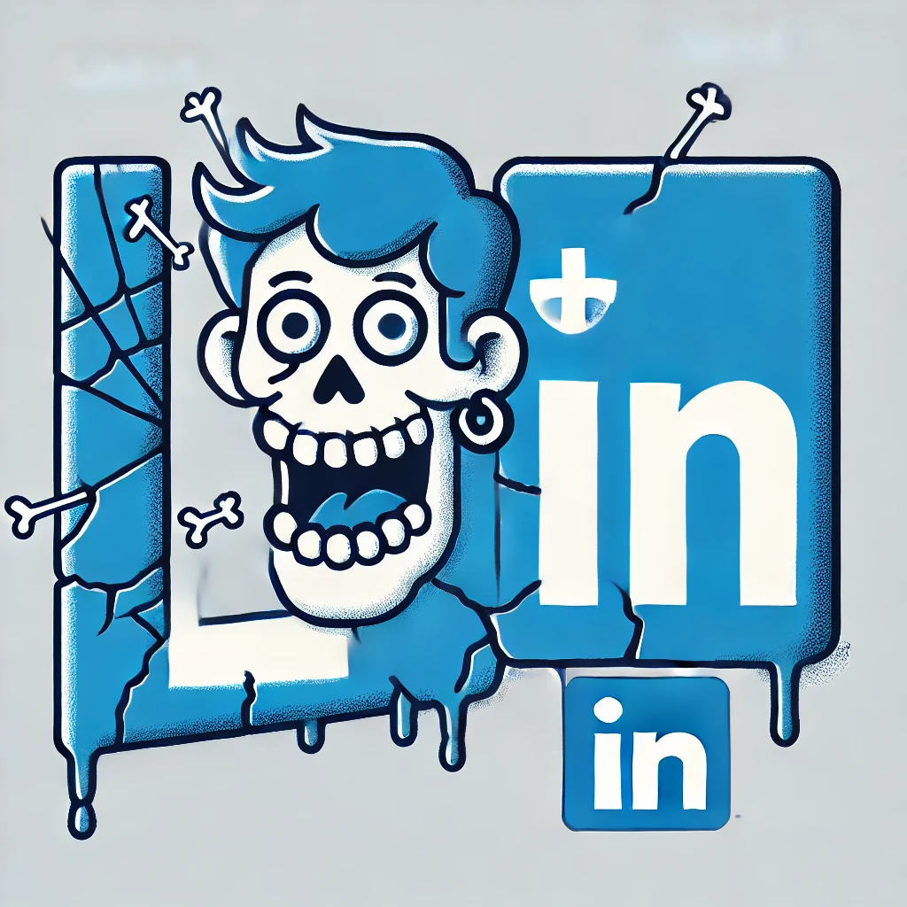

# KilledIn



KilledIn is a browser extension designed to enhance your LinkedIn experience by monitoring the feed for specific text content and removing unwanted elements. This extension is particularly useful for users who want to filter out certain types of content from their LinkedIn feed.

## Features

- Monitors LinkedIn's feed for added elements.
- Removes elements based on specific forbidden text content.
- Provides a simple UI accessible from the browser toolbar.

## Installation

1. Clone the repository to your local machine.

   ```bash
   git clone https://github.com/samsour/killed-in.git
   ```

2. Open your browser and navigate to the extensions page:

   - For Chrome: `chrome://extensions/`
   - For Firefox: `about:addons`

3. Enable "Developer mode" (Chrome) or "Debug Add-ons" (Firefox).

4. Click "Load unpacked" (Chrome) or "Load Temporary Add-on" (Firefox) and select the cloned directory.

## Usage

- Click on the KilledIn icon in the browser toolbar to open the popup UI.
- The extension will automatically start monitoring your LinkedIn feed for forbidden text content and remove matching elements.

## Development

### Prerequisites

- Node.js and npm (for any build tools or dependencies)
- A modern web browser (Chrome or Firefox)

### Code Structure

- **manifest.json**: Defines the extension's metadata and permissions.

  ```json:manifest.json
  startLine: 1
  endLine: 25
  ```

- **content.js**: Contains the logic for monitoring and modifying the LinkedIn feed.

  ```javascript:content.js
  startLine: 1
  endLine: 50
  ```

- **popup.html**: Provides the UI for the extension's popup.
- **popup.js**: Handles interactions within the popup.

## Contributing

Contributions are welcome! Please fork the repository and submit a pull request for any improvements or bug fixes.

## License

This project is licensed under the MIT License.

## Disclaimer

KilledIn is not affiliated with LinkedIn in any way. In fact, LinkedIn probably doesn't even know we exist. But if they did, they'd probably be impressed by our dedication to cleaning up their feed. Use at your own risk, and remember: with great power comes great responsibility (and possibly a cleaner LinkedIn experience).

## Contact

For questions or feedback, please contact [yourname@example.com](mailto:yourname@example.com).
